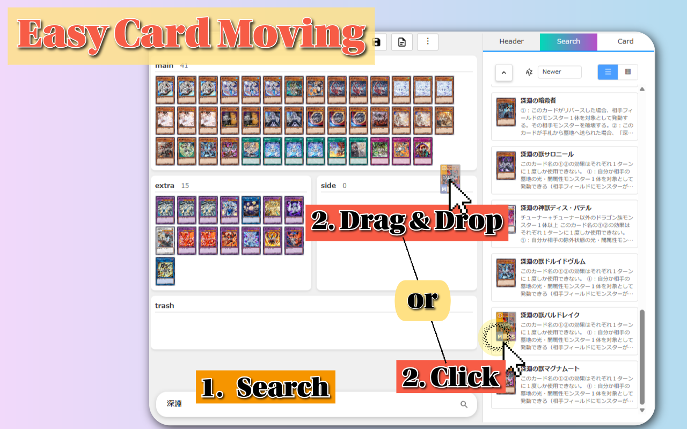
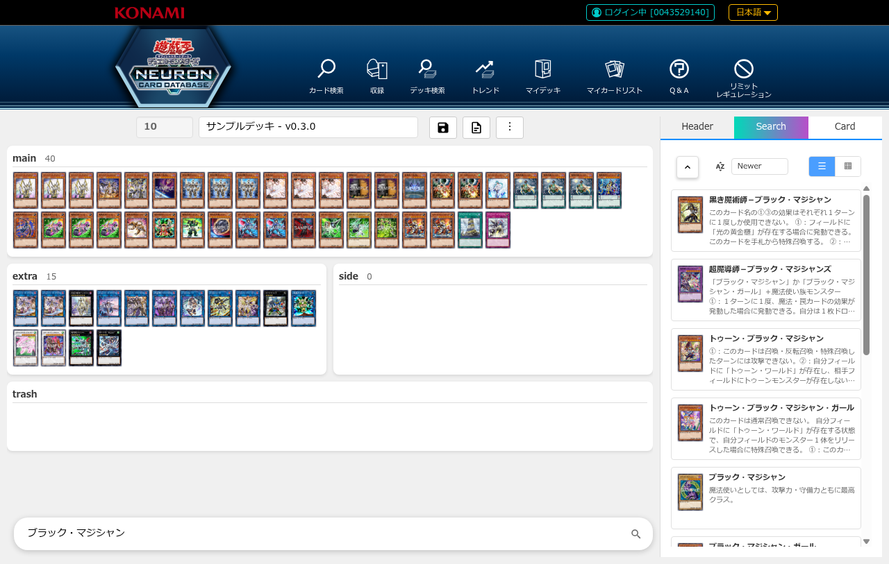
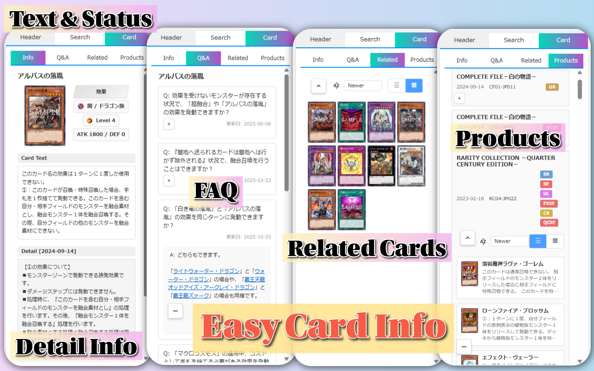
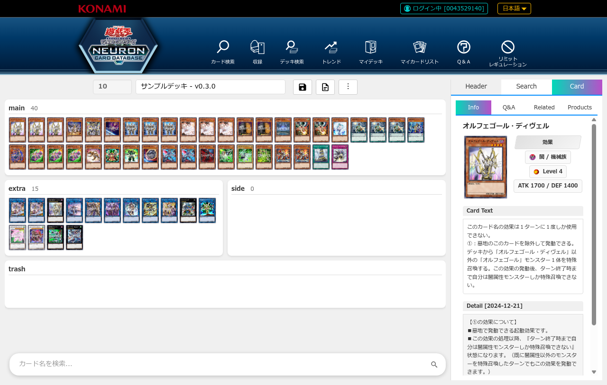
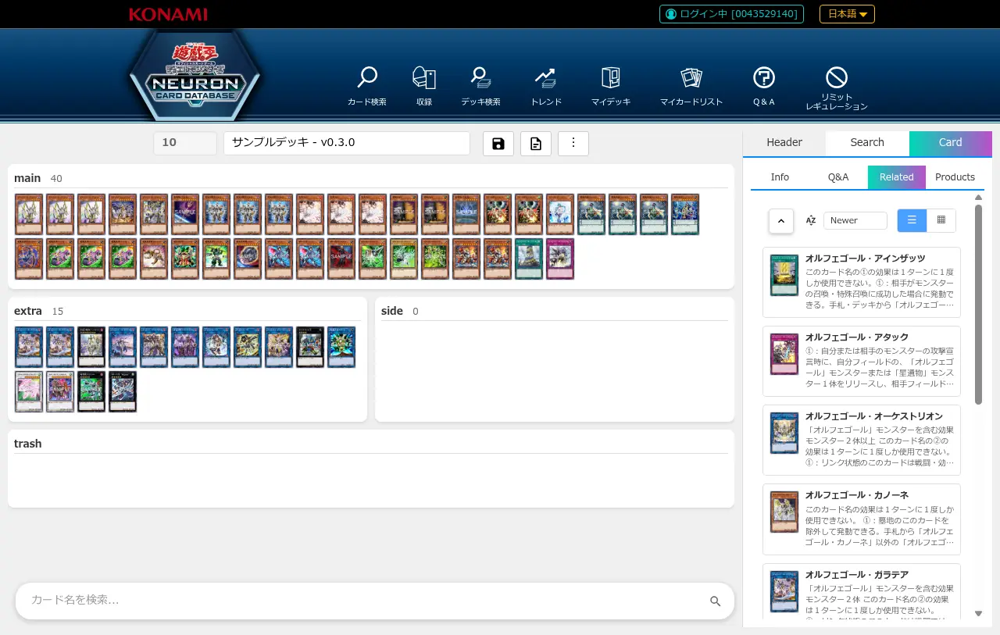
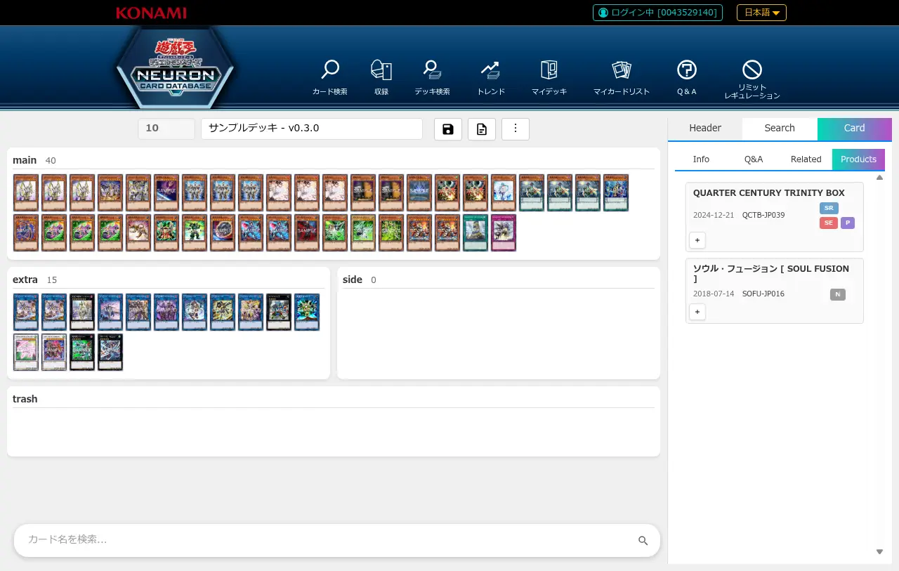
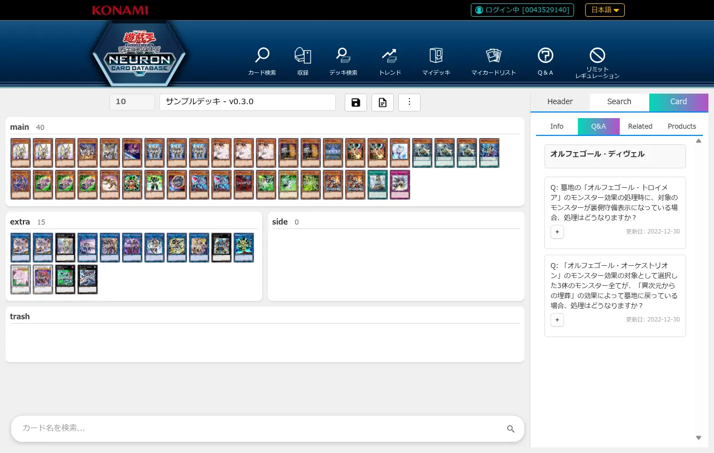

# デッキ編集機能

## 概要

遊戯王公式カードデータベースのデッキ詳細ページに、インタラクティブなデッキ編集UIを追加します。

**主な機能:**
- カード検索から簡単に追加
- ドラッグ&ドロップまたはクリック操作で移動
- ページを移動せずにカード詳細を確認
- レギュレーションタグで制限リスト・GENESYSポイントを反映

## UIの全体構成

デッキ編集画面は、左側にデッキエリア、右側にカード検索・詳細表示エリアの2カラム構成です。

**画面構成:**
- **左側**: デッキエリア（メインデッキ、エクストラデッキ、サイドデッキ）
- **右側**: 3つのタブでカード検索・詳細表示
  - **Header**: デッキ名入力、保存/削除ボタン
  - **Search**: カード検索機能
  - **Card**: カード詳細情報表示（Info/Related/Products/Q&A）
- **上部ツールバー**: Undo/Redoボタン、デッキ操作メニュー

**カスタマイズ:**
デッキ編集画面の表示や動作は[オプションページ](./options.md#1-デッキ編集画面タブ)で変更できます。

| 設定項目 | 説明 |
|---------|------|
| [画像の大きさ](./options.md#表示する画像の大きさ) | カード画像のサイズ（S/M/L/XL） |
| [検索入力欄の位置](./options.md#検索入力欄の位置) | 検索バーの配置場所 |
| [Side/Extra配置](./options.md#sideextraセクションの配置) | 縦並び/横並び |
| [右エリアの幅](./options.md#右エリアの幅) | 固定幅またはMAX-FIT（残りスペースを使用） |
| [右エリアのフォントサイズ](./options.md#右エリアのフォントサイズ) | テキストサイズ（S/M/L/XL） |
| [デッキ枚数制限](./options.md#デッキ枚数制限) | 制限なし/現行制限 |
| [未保存時の警告](./options.md#未保存時の警告) | 警告の表示条件 |
| [高度なマウス操作](./options.md#高度なマウス操作) | 右クリック/中クリックの有効化 |
| [ソート順設定](./options.md#レベルランクリンクの並び順) | レベル順、カテゴリ内の並び順 |

## 機能

### 0. デッキ操作機能（v0.4.1追加）

画面上部のツールバーからデッキの基本操作を実行できます。

#### Undo/Redo
カード追加・削除・移動の操作を取り消したり、やり直したりできます。

**使い方:**
- **Undoボタン**: 直前の操作を取り消す（最大20履歴）。tooltipに次に取り消される操作内容を表示
- **Redoボタン**: 取り消した操作をやり直す。tooltipに次にやり直される操作内容を表示
- **キーボードショートカット**: Ctrl+Z (Undo), Ctrl+Shift+Z (Redo)

**操作履歴ダイアログ:**
メニューの「Operation History」から操作履歴ダイアログを開けます。全操作の履歴を一覧表示し、クリックで任意の履歴位置にジャンプできます。

**記録される操作:**
- カードの追加
- カードの削除（ゴミ箱への移動）
- カードの移動（Main ⇔ Extra ⇔ Side）
- ソート順の変更
- シャッフル
- 並び替え

#### デッキ操作メニュー
メニューボタン（⋮）から以下の操作が可能です：

- **新規作成**: 空のデッキを新規作成
- **複製**: 現在のデッキを複製して新しいデッキを作成
- **削除**: 現在のデッキを削除
- **Reload**: デッキを最新状態に再読み込み（他のデバイスで編集した内容を反映）

#### 未保存時の警告
デッキを編集後、保存せずにページを離れようとすると確認ダイアログが表示されます。

**設定で変更可能:**
- **Always**（デフォルト）: 常に警告
- **Without sorting order only**: ソート順変更のみの場合は警告しない
- **Never**: 警告しない

設定方法: オプションページ > デッキ編集画面 > UX設定

---

### 1. ドラッグ&ドロップでカード移動

カードをドラッグして別のデッキエリアにドロップすることで、簡単にカードを移動できます。

**対応エリア:**
- メインデッキ
- エクストラデッキ
- サイドデッキ

**使い方:**
1. カードをクリック&ホールド
2. 移動先のエリアまでドラッグ
3. ドロップ

### 2. カード検索エリア

デッキに追加したいカードを検索できます。

**検索方法:**
- カード名で検索
- 属性・種族・レベルなどで絞り込み

**カードの追加:**
- 検索結果のカードをクリックして `M` ボタン（メイン/エクストラ）または `S` ボタン（サイド）でデッキに追加

**使い方:**
1. 右側の「Search」タブをクリック
2. 検索欄にカード名を入力（例: 「ブラック・マジシャン」）
3. 検索ボタンをクリック
4. 検索結果からカードを選択してデッキに追加

### 3. カード操作ボタン

各カードに表示されるボタンでカードを操作できます。

#### デッキ内カード（メイン/エクストラ/サイド）のボタン

- **ⓘ** (左上): カード詳細を表示
- **+** (右下): 同じカードを1枚追加
- **ゴミ箱アイコン** (左下): ゴミ箱セクションに移動
- **S** (右上、メイン/エクストラのみ): サイドデッキに移動
- **M** (右上、サイドのみ): メイン/エクストラデッキに移動

#### 検索結果カードのボタン

- **M** (左下): メイン/エクストラデッキに追加
- **S** (右下): サイドデッキに追加

#### ゴミ箱内カードのボタン

- **M** (左下): メイン/エクストラデッキに戻す
- **S** (右下): サイドデッキに戻す

### 4. 表示モード切り替え

カードの表示方法を切り替えられます。

**モード:**
- **リスト表示**: カード名と枚数を一覧表示（デフォルト）
- **グリッド表示**: カード画像をタイル状に表示

**切り替え方法:**
- カードリスト右上の切り替えボタンをクリック

### 5. スムーズなアニメーション

カードの移動や追加・削除時に、視覚的にわかりやすいアニメーションが表示されます。

### 6. カード詳細表示

デッキに含まれるカードを選択すると、右側のCardタブにカード詳細情報が表示されます。

**表示内容:**
- **Info**: カードの基本情報（属性、種族、レベル、攻撃力/守備力、テキストなど）
- **Related**: 関連カード一覧
- **Products**: このカードを収録しているパック・商品一覧
- **Q&A**: このカードに関する公式Q&A

#### Info タブ

カードの基本情報を表示します。

**表示内容:**
- **カード画像**: 大きめのカード画像を左側に表示
- **基本情報**: 属性、種族、レベル/ランク/リンク、攻撃力/守備力
- **カードテキスト**: カード効果・フレーバーテキスト
- **ペンデュラムテキスト**: ペンデュラムモンスターの場合、ペンデュラム効果を表示
- **補足情報（Detail）**: 公式から提供されるカードの追加説明や裁定情報
  - カード名の後ろに `[更新日]` が表示されます
  - 補足情報内に登場する他のカード名（下線付き青色テキスト）をクリックすると、そのカード詳細にジャンプできます
- **ペンデュラム補足情報（Pend. Detail）**: ペンデュラム効果に関する補足説明

**表示順序:**
1. Pend. Text（ペンデュラムテキスト）
2. Pend. Detail（ペンデュラム補足情報）
3. Card Text（カードテキスト）
4. Detail（補足情報）

#### Related タブ

関連カード（同じシリーズ、サポートカードなど）を表示します。

#### Products タブ

このカードが収録されているパック・商品の一覧を表示します。

#### Q&A タブ

このカードに関する公式Q&Aを表示します。質問の展開ボタン（+）をクリックすると回答が展開されます。

**主な機能:**
- **FAQ一覧表示**: カードに関する質問と更新日を一覧表示
- **展開/縮小**: 質問の左側の「+」ボタンで回答を展開、回答下部の「−」ボタンで縮小
- **カードリンク**: 質問や回答内に登場する他のカード名（下線付き青色テキスト）をクリックすると、そのカード詳細にジャンプ
- **スムーズアニメーション**: 展開・縮小時に滑らかなアニメーションで表示

**FAQ状態管理:**
- 一度展開したFAQの回答はキャッシュされ、再展開時に即座に表示されます
- 同じFAQID（質問番号）を持つFAQは、カードが異なっても展開状態を共有します
- カードを切り替えても、異なるFAQの回答が混在することはありません

### 7. リミットレギュレーション・GENESYSポイント

デッキ名にレギュレーションタグを付けると、OCG制限リストやGENESYSポイント（禁止・制限の枠組み）をデッキ編集画面に反映できます。

#### レギュレーションタグの書式

デッキ名の **先頭または末尾** にタグを付けます。

| タグ | 意味 |
|------|------|
| `[OCG]` | OCG制限リストの最新版を適用 |
| `[OCG-2410]` | OCG制限リストの 2024年10月版を適用 |
| `[GENESYS]` | GENESYSポイントの最新版を適用 |
| `[GENESYS-2608]` | GENESYSポイントの 2026年8月版を適用 |
| `[GENE]` | `[GENESYS]` の省略形（入力時のみ有効） |

**対応する括弧**: `[ ]` と 【 】（隅付き括弧）の両方が使えます。レギュレーション名の大文字・小文字は問いません。

**配置のルール（重要）**:
- タグは **デッキ名の先頭または末尾** である必要があります。デッキ名の中央にあるタグは認識されません。
- 先頭に置く場合、閉じ括弧の直後に **空白またはデッキ名の終わり** が必要です。
  - 有効: `[OCG] デッキ名`、`[OCG]` 単独
  - 無効: `[OCG]デッキ名`（密着すると認識されません）
- 末尾に置く場合、開き括弧の直前に **空白またはデッキ名の先頭** が必要です。
  - 有効: `デッキ名 [GENESYS]`
  - 無効: `デッキ名[GENESYS]`
- YYMM（4桁）を省略すると **最新版** が適用されます。

#### タグの入力補完

デッキ名入力欄の **先頭** で `[` または 【 を入力すると、実在する制限リストの版が候補として表示されます。

- **候補順**: `OCG 最新版` → `GENESYS 最新版` → OCG各版（新しい順） → GENESYS各版（新しい順）
- 括弧の中に続けて文字を打つと、リアルタイムで候補が絞り込まれます（例: `o` を打つとOCG系のみに絞り込み）
- **キーボード操作**: `↓` / `Tab` = 次の候補、`↑` = 前の候補、`Enter` = 選択、`Esc` = 閉じる

※ 補完はデッキ名の先頭入力時のみ動作します。末尾入力では候補は出ません。

#### レギュレーションバッジ

タグが認識されると、デッキ名入力欄の右上に `OCG` または `GENESYS` のバッジが表示されます（レイアウト幅は変わりません）。

- バッジにマウスを乗せると、適用中の版がツールチップで表示されます（例: `適用中: OCG 2024年10月版`、`適用中: GENESYS 最新版`）
- 指定した版が存在しない場合（フォールバック時）はバッジが **赤色** になり、ツールチップで採用された直近版が説明されます（例: `指定 OCG-2410 は存在しないため、直近版 OCG-2407 を適用中`）

#### GENESYSポイント表示

`[GENESYS]` 系タグを適用中は、各カード画像の下部に GENESYSポイントが `13pt` のように表示されます。

| ポイント | 色 | 目安 |
|----------|----|------|
| 1〜3pt | 黄 | 準制限相当 |
| 4〜7pt | 橙 | 制限相当 |
| 8pt以上 | 赤 | 禁止相当 |

- 0ptのカード（OCGの無制限カードに相当）にはバッジが表示されません
- GENESYSモードでは、OCGの禁止/制限/準制限アイコンの代わりにptバッジが表示されます
- ※ デッキ全体の合計pt（100ptなど）の計算・チェック機能はありません

#### 指定版が存在しない場合の修正提案

デッキを読み込んだ際、指定した版（YYMM）が存在しないと、直近版への修正を提案するダイアログが表示されます。

- **タグを修正**: デッキ名のタグを直近版に書き換えます（例: `[GENESYS-2606]` → `[GENESYS-2608]`）
- **このまま使う**: 直近版を適用したまま使い続けます。以後このデッキでは修正提案ダイアログは表示されません

※ 「このまま使う」を選んだデッキで、改めてダイアログを表示する手段はありません。ただしレギュレーション判定自体（バッジ・pt表示）は継続して行われます。

## 対応言語

- **日本語**: 完全対応
- **英語**: 完全対応

言語は自動検出されます。

## カードリンク機能

カードの補足情報（Info タブ）やQ&A（Q&A タブ）に登場する他のカード名をクリックすると、そのカード詳細を即座に表示できます。

**使い方:**
1. Info タブまたは Q&A タブでカード名を探す
2. 下線付き青色のカード名をクリック
3. 自動的にそのカードの Info タブが表示される

**対象:**
- Info タブの補足情報（Detail、Pend. Detail）
- Q&A タブの質問と回答

**表示形式:**
- カード名は `{{カード名|カードID}}` の形式で内部的に管理されています
- ユーザーには下線付き青色のリンクとして表示されます

## 使用例

### 基本的なデッキ編集フロー

1. デッキ詳細ページを開く
2. デッキ編集UIが自動的に表示される
3. Headerタブでデッキ名を編集

4. 検索エリアでカードを検索
5. 検索結果から `M` ボタン（メイン/エクストラ）または `S` ボタン（サイド）でデッキに追加
6. ドラッグ&ドロップでカードを整理
7. 完成したデッキを確認

### カードの移動と削除

#### ゴミ箱への移動（一時削除）

1. 移動したいカードを探す
2. カード左下のゴミ箱アイコンをクリック
3. カードがゴミ箱セクションに移動
4. ゴミ箱から戻す場合は、ゴミ箱内カードの `M` ボタン（メイン/エクストラ）または `S` ボタン（サイド）をクリック

#### サイドデッキへの移動

1. サイドに移動したいカードを探す
2. カード右上の `S` ボタンをクリック
3. カードがサイドデッキに移動

#### メイン/エクストラデッキへの移動

1. サイドデッキからメイン/エクストラに移動したいカードを探す
2. カード右上の `M` ボタンをクリック
3. カードがメイン/エクストラデッキに移動

## 注意事項

### デッキ枚数制限

- **メインデッキ**: 40〜60枚
- **エクストラデッキ**: 0〜15枚
- **サイドデッキ**: 0〜15枚
- **同じカード**: メイン・エクストラ・サイド合計で最大3枚まで

※ 同じカードをメイン・エクストラ・サイドに合計3枚まで追加できます。4枚目を追加しようとすると無効化されます。
※ デフォルトでは禁止・制限カードのチェックを行いません。レギュレーションタグ（`[OCG]`/`[GENESYS]`）を付けると制限リスト・GENESYSポイントが反映されます（詳細: [リミットレギュレーション・GENESYSポイント](#7-リミットレギュレーションgenesysポイント)）

### 保存機能

デッキ名入力欄の **save** ボタンで、編集内容を遊戯王公式カードデータベースに保存できます。保存内容は公式サイトのデッキとして反映されます。

## トラブルシューティング

### Q: デッキ編集UIが表示されない

**A:** 以下を確認してください:
- 拡張機能が有効になっているか
- デッキ詳細ページにアクセスしているか
- ページを再読み込みしてみる

### Q: カードをドラッグできない

**A:** 
- ブラウザのバージョンを確認
- ページを再読み込み
- 一度カードをクリックしてから再試行

### Q: アニメーションが遅い

**A:**
- ブラウザのハードウェアアクセラレーションを有効化
- 他のタブを閉じてリソースを確保

### Q: 英語版で正しく動作しない

**A:**
- 言語が正しく検出されているか確認
- コンソールにエラーが出ていないか確認
- Issue を報告

## フィードバック

バグ報告や機能要望は、GitHubのIssueでお願いします。

## 次のステップ

- [シャッフル機能](./deck-show.md#カードのシャッフル)
- [デッキ画像作成](./deck-show.md#デッキ画像作成)
